# **AЯ**CHIVE

## Content
1. [Summary](#summary)
1. [UX](#ux)
    1. [Strategy](#strategy)
    1. [Scope](#scope)
    1. [Structure](#structure)
    1. [Skeleton](#skeleton)
    1. [Surface](#surface)
1. [Features](#features)
    1. [Existing Features](#existing-features)
    1. [Features left to implement](#Features-left-to-implement)
1. [Bugs](#bugs)
1. [Technologies used](#Technologies-used)
1. [Testing](#testing)
1. [Deployment](#deployment)
    1. [Local deployment](#Local-deployment)
    1. [heroku](#heroku)
1. [Credits](#credits)
    1. [Book Content](#book-content)
    1. [Acknowledgements](#Acknowledgements)

#

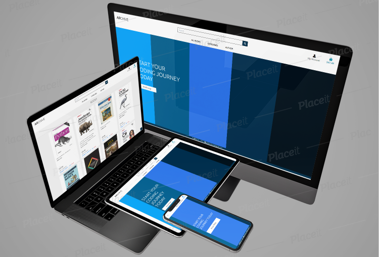

Archive has been deployed to heroku and can be viewed from [here](https://ebuyal-archive.herokuapp.com/)

# Summary

Archive is an e-commerce store selling **programming** books. 

This site has the aim to sell programming books to students and people interented in programming. I specifically choose more popular programming languages books to encourage interest and motivate to study the most popular programming languages out there, adn by that sell books. Another motivation from my side was to specifically fix the delivery cost, wherever customers live they always pay the same amout of delivery cost. Books can be searched, viewed either by being logged in or not, bags can be saved until users go back to online book store to later make a checkout. If logged in user make a purchase their order confirmation is sent by mail to their added E-mail address and will be saved to profile page. Customers that have not logged in can choose to create an account to proceed or make a secure checkout. If not logged in customer will recieve an order confirmation mail to added E-mail address.

Page owner/admin can arrange books by adding to store, edit or delete.

# UX
## Strategy
### First time site user's goals:
* As a new site user, I want to be able to understand what the site is offering me
* As a new site user, I want to be able to have a quick access to books in the store
* As a new site user, I want to be able to browse and search for books
* As a new site user, I want to be able to see a list of books with neccessary information
* As a new site user, I also want to be able to view detailed description and information about each book
* As a new site user, I want to be able to understand the purpose of this site
* As a new site user, I want to easily navigate through the page
* As a new site user, I want to easily choose books and securely checkout by using an intuitive layout
* As a new site user, I want to make a checkout without creating an account
* As a new site user, I want to easily create an account for future purchases
* As a new site user, I want to sort books by categories
* As a new site user, I want to sort books by price
* As a new site user, I want to sort books by author
* As a new site user, I want to change the books in my bag changing quantity and removing them
### Returning user's goals:
* As a returning user, I want to log in and out on the page
* As a returning user, I want to recover forgotten password if I would need to
* As a returning user, I want to save my information in my profile to make purchases easily in future
* As a returning user, I want to view order history in profile page

### Site owner's goals:
* As a site owner, I'd like to give an quick and understandable introduction of my site.
* As a site owner, I'd like my page to be intuitive and informative for users.
* As a site owner, I'd like my page to create, edit and delete books
* As a site owner, I'd like to manage my site by creating, editing and deleting books and that these features is restricted to only me and other superusers
* As a site owner, I'd like to have an admin login page where I can manage my books, list order history and list users

## Scope
### Functional requirements:
#### For ease of use:
* Navigation bar which is intuitive and easy to navigate with
* A search box
#### To ensure the database is up to date and editable:
* Function to add a book
* Function to edit a book
* Function to delete a book
* For books to only be editable by superusers

### Content requirements:
#### To ensure the site is visually appealing and to draw the users interest:
* Book covers
* Bluish, white colors and sometimes black color details to not distract users to much and give them a flawless experience of the page, which is books with their covers and neccessary information about each

### For usability
* Clear links, buttons and overall easy for eye design of the site so users can focus on main reason they are visiting this page, to go ahead and make a purchase 

## Structure
### Database Schema

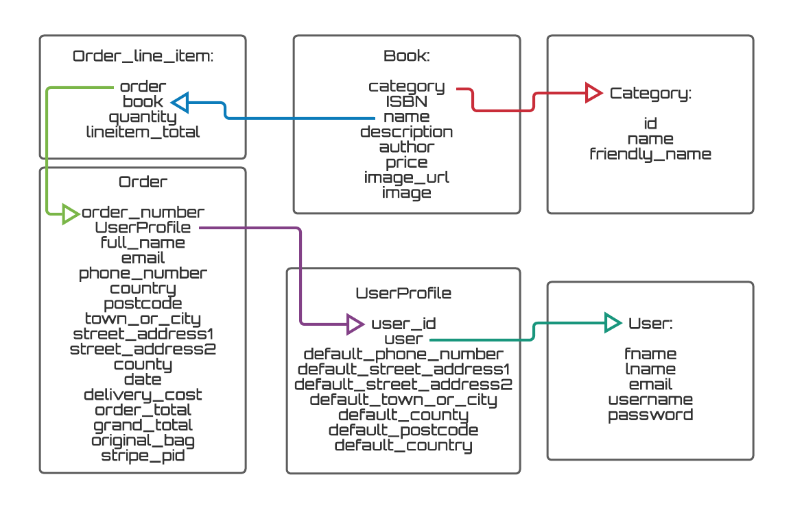

### Interaction design:
* User friendly interface to ensure usability and to encourage the user to return
* Eyecatching and responsive design with buttons and links which can change on hover to provide users understandable actions to navigate through the site
* Ability to close such things like toasts on the top of the page without being distracted

### Information Architecture:
* Navigation bar at the top of the page
* Responsive navigation bar, changing layout depending on screen size for maximum user friendlyness
* Responsive book covers fixed to fit into its places, depending on which place page in the site users are in, independent of different screen sizes
* Features like links, increment/decrement buttons, scroll-back-to-top, navigation buttons and other are in appropriate sizes and responsive to desktop, tablet and mobile screens
* Information on the site such as "keep shopping" on the bag details page and "Forgot to buy a book? Go back to book store" on the success checkout page is easy to understand and will step by step lead users from to where they want to go to or go back to 

## Skeleton

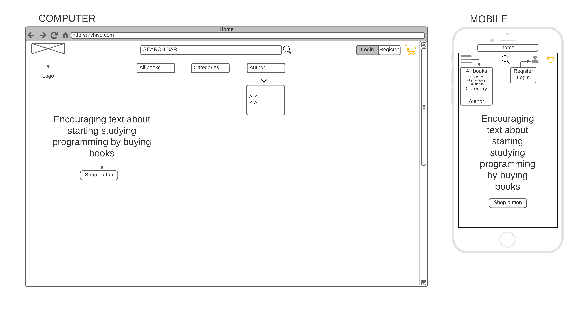
All **wireframes** can be shown **[here](media/readme/wireframe/)**

## Surface

* Chosen font family is Ubuntu, gives a nice and futuristic look to overall fonts at the site. Main reason I choose Ubuntu was because it gives programming vibes and increases lust to dig into the page even more.
* Selected color scheme is a nice dark blue color used throughout the page. This blue color is also appearing at the landing page and continues to be in buttons, texts and inside most of crispy form fields. White, whitesmoke and black color is also used in various texts and some buttons. 

# Features
## Existing Features
Feature | Details
--------|--------
Sign in | Already signed up users can sign in and faster make checkouts because there is an feature to save delivery information, latest bag can also be saved to come back and make checkout
Sign out | Sign out for security reasons, in case user device could be exposed to other people. 
Add book | Superusers can add books to the site 
Edit book | Superusers can edit books
Delete book | Superusers can delete books
Search function | The users are able to search in the book database on the search box placed on the navigation bar. Whether users is signed in or not they can use the search function
Sort function | Users can sort books by category, price and author
Shopping bag | Users add books to bag and can update quantity or delete books in the bag page
Payment | Users add books to shopping bag and proceed to secure checkout to make payment with credit card

## Features left to implement
Feature | Details
--------|--------
Used books | For individual persons a functionality to add used education books to the site and sell them for an small amount of fee payed to site owner. Books that fulfills requirements as not being a too old version and that books are in decent shape would be allowed to be sold
Book suggestion page | Page where users can suggest books that they would like have on the site so they can buy them
Community page | Users community page where they are able to chat with each other about programming and education
#
# Bugs
## Bugs and fixes during development
### Server 500 error
During testing of Stripe webhooks it was throwing an error 500: 
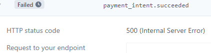

Charge.succeeded and payment_intent.created was successful but payment_intent.succeeded was giving an error. However I got an "AttributeError", which usually means you're calling an attribute (i.e. trying to get its value) that either doesn't exist or its name is slightly different than you're calling it.
It seemed that saveinfo was most likely either undefined or misspelled. 

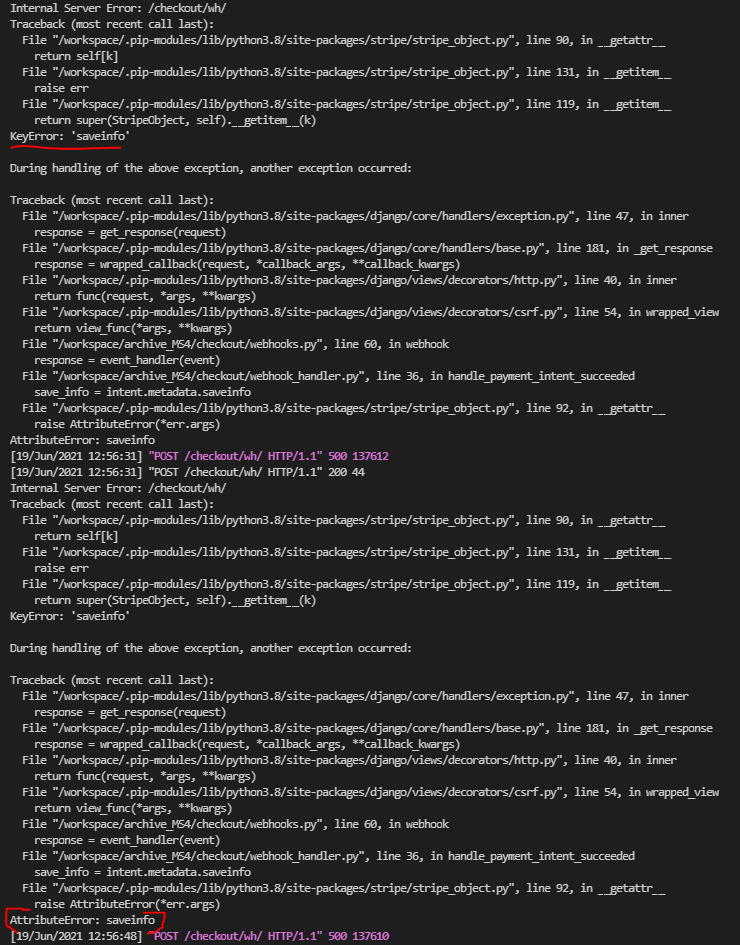

Because I was getting KeyError: 'saveinfo' and AttributeError: saveinfo, I decided to look up where I had written this and found it here in the webhook_handler.py:

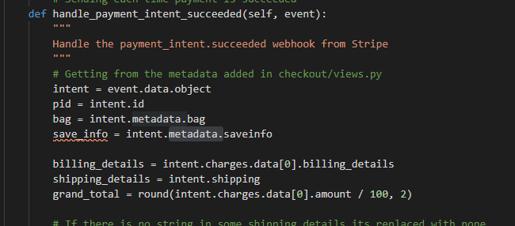

My webhook was looking for intent.metadata.saveinfo and it couldn’t find it because saveinfo doesn't exist and is misspelled, a typical typo. 

In Webhook_handler.py file I fixed the typo and tested webhooks again:

Terminal:

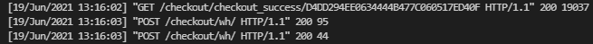

Stripe:

After changing to intent.metadata.save_info I started the server, added books to bag and proceeded to checkout and this time I recieved webhooks succeeded and problem was solved.

### POST error
**In terminal I got:** RuntimeError: You called this URL via POST, but the URL doesn't end in a slash and you have APPEND_SLASH set. Django can't redirect to the slash URL while 
maintaining POST data. Change your form to point to localhost:8000/bag/remove/10/ 
(note the trailing slash), or set APPEND_SLASH=False in your Django settings.

deleted: /
path('remove/<book_id>' at the end of "<book_id>" from bag, urls.py

source: https://stackoverflow.com/questions/9738824/django-post-url-error

### Data Error
Console showed: Data attribute is not defined in bag.html

**I added:**
var data = {'csrfmiddlewaretoken': csrfToken}; to **bag.html** and error was solved.

source: https://docs.djangoproject.com/en/3.2/ref/csrf/

### Stripe API key
**Console showed:** stripe.error.AuthenticationError: You did not provide an API key.

After installing stripe and adding public key and secret key I got an error telling
that I have not entered any API key. Going back to slack I was able to see that 
people have asked about same error message. 

Before looking at slack I managed to find out on the internet to add stripe api key and connected it to stripe secret key. While testing to print() error and refreshing project page an stripe error occured. At that time I had already added stripe to **settings. py**,
and added public key and secret key to my environment variables in my Workspace, but
error would not disappear. 

Later I found out on a slack feed that this error 
can occur and that basic fix could be to stop Worspace to refresh all pages connected
to Stripe to start Workspace and test again. This time my print worked and I did not
see any errors at the checkout page. 

# Technologies Used
* Git
* Gitpod
* GitHub
- [Django](https://www.djangoproject.com/)
- [Bootstrap5](https://getbootstrap.com/)
- [jQuery](https://jquery.com/)
- [Django AllAuth](https://django-allauth.readthedocs.io/en/latest/)
- [Pillow](https://pillow.readthedocs.io/en/stable/index.html)
- [Crispy Forms for Bootstrap5](https://github.com/django-crispy-forms/crispy-bootstrap5)
- [Django Countries](https://pypi.org/project/django-countries/)
- [DJ Database URL](https://pypi.org/project/dj-database-url/)
- [Psycopg2](https://pypi.org/project/psycopg2-binary/)
- [Gunicorn](https://pypi.org/project/gunicorn/)
- [Boto3](https://pypi.org/project/boto3/)
- [Django Storages](https://pypi.org/project/django-storages/)
- [Heroku](https://heroku.com/)
- [Postgresql](https://www.postgresql.org/)
- [Gmail](https://mail.google.com/mail/)
- [Google fonts](https://fonts.google.com/)
* Python
* JavaScript
* HTML5
* CSS3
* [HTML validator](https://validator.w3.org/)
* [CSS validator](http://www.css-validator.org/)
* [PEP8](http://pep8online.com/)
* [JShint](https://jshint.com/)
* [Chrome Dev Tools](https://developer.chrome.com/docs/devtools/)
* [AWS](https://aws.amazon.com/)
* Jinja
* [Favicon.io](https://favicon.io/)

# Testing
### First time visiting site testing:
* As a new site user, I want to be able to understand what the site is offering me
    - Visting site for the first time user sees an information text which tells to start coding journey
    - And by clicking on the **Book Shop** button user can continue its story
* As a new site user, I want to be able to have a quick access to books in the store
    - User have access to the books in the store by clicking on Book Shop button and/or by using buttons on the navigation bar
* As a new site user, I want to be able to browse and search for books
    - Users are automatically greeted with a navigation bar, a search box and buttons with different actions of filtering books
* As a new site user, I want to be able to see a list of books with neccessary information
    - When user has entered books page, books are listed and general information about each book is shown before proceeding
* As a new site user, I also want to be able to view detailed description and information about each book
    - By clicking on desired book cover user is redirected to a book detail page with extra content about the book like book description
* As a new site user, I want to be able to understand the purpose of this site
    - Upon entering the page, there is a self-narrative button saying Book Shop. Also site name and the text above the shop button gives clues about site purpose
* As a new site user, I want to easily navigate through the page
    - The navigation bar has clear and easy to understand links exposing books by different filters
    - There is a search box, bag link and my account link if in future user would sign up
* As a new site user, I want to easily choose books and securely checkout by using an intuitive layout
    - Every book is added to bag in book detail page by clicking on add to bag button, beside this button user can easily go back to books page by clicking on keep shopping button
    - When bag is complete user sees a toast with checkout button to then continue to secure checkout
* As a new site user, I want to make a checkout without creating an account
    - By clicking on secure checkout when user is on bag details page, user can checkout without the need to create a profile/account
* As a new site user, I want to easily create an account for future purchases
    - User can create a profile/account by using the link My account link on the navigation bar or while making a secure checkout clicking on sign up link
* As a new site user, I want to sort books by categories/price/author
    - On the navigation bar, there are all books/categories/author buttons with drop down boxes which allows the user to select specific sorting of books
* As a new site user, I want to change the books in my bag changing quantity and removing them
    -  Users shopping bag has update and delete buttons to make changes

### Returning user testing:
* As a returning user, I want to log in and out on the page
    - User can by clicking on the my account link on the navigation bar sign in to profile with username/E-mail address
* As a returning user, I want to recover forgotten password if I would need to
    - With Django all auth packages user can on the sign in page click on the password recovery link and proceed to recover its password
* As a returning user, I want to save my information in my profile to make purchases easily in future
    - On the users profile page they can personalize their profile by changing delivery information
* As a returning user, I want to view order history in profile page
    - On the profile page users can view their order history and check their order details by clicking on the order

### Site owner testing:
* As a site owner, I'd like my page to create, edit and delete books
    - There is an edit button on each book card which takes the user to a form where they can edit the content and image
    - There is an delete button on each book card
* As a site owner, I want to the ability to create, edit and delete books to be limited to superusers
    - By taking advantage of jinja logic, it is used in html code and @login_required decorator is used in views. py so that site security is restricted to superuser. Site owner can as mentioned above edit, delete and on the Book Management page create a new book to be added to inventory. 

# Testing Process

## Manual Testing
Manual testing was done throughout the development process. Often when new features were implemented, but also every now and then to make sure whole application was working properly.

* Links:
    - I will test the links in the header and mailto: in footer, and also links in toasts. Since they are inherited from the base.html file. In the header, I will test the links on all sizes and when signed in and signed out.
        - **Result:** All links, including toasts, recovery password, sign in page and signup page, work correctly depending on screen sizes and whether user is signed in or signed out. When clicking on the mail in footer user is redirected to its mail application to write an E-mail. 
* **Access to pages:**
    - Users should not be able to access to admin pages without logging in, or be able to make superuser changes or edit books in the page
    - They should not be able to use links like profile page to get into the profile without being logged in
        - **Result:** Users with no admin account cannot access admin pages and therefore, they cannot not make changes on the page like editing books, deleting books or adding books
        - Users trying to use profile page links are being redirected to sign in page if they are not logged in
* **Forms:**
    - Each field in each form with a variety of inputs such as text strings, numbers and other characters will be tested. Forms should not be submitted without fulfilling requirements
        - Register, sign in, reset password, recover password and change password, all AllAuth's, have passed the test and would not submit if required fields is left empty
        - Adding book to bag or updating bag have also been tested with success
* **Checkout Form:**
    - I will test the checkout form and ensure it is successful. I will also test how Stripe behave even though I have tested Stripe throughout the project. A check whether an E-mail is sent from archive to users E-mail will be made
        - Checkout form whether user is logged in or logged out, Stripe Webhooks and sending E-mail are all successful

        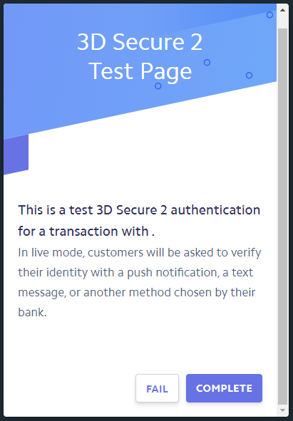
        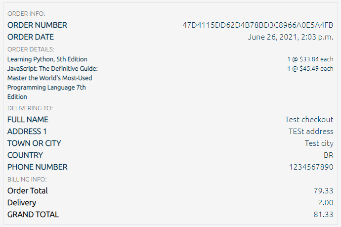
        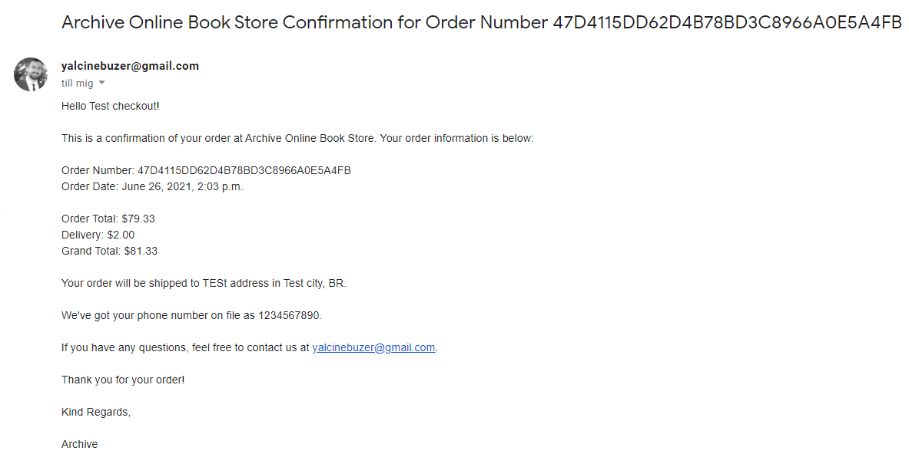

* **Sign in and Sign out:**
    - I will test: sign up process, sign in, sign out, change password and reset password
        - User sign up recieves a verification E-mail sent, until then they cannot login to their profile, sign out, change password and reset password together with verification E-mail all works succesfully

### Responsive testing
* **Responsive site testing:**
    - I will adjust the width of each page from full width, in my case 1920px, to the width of tablet and mobile phone. Modern mobile width is approximately 320px. There is a point when page content on all pages loses UX because of too small resolution. My aim have been to make all pages look good down to 320px. Each test will be tested on varieties of devices. All tests will be made on computer(1920px), laptop, mobiles(iphone 11 and iphone 7 plus) and tablet(Ipad Air).
    - **Results:** 
        - **Header** is looking good up from 1920px down to approximately 317 px on all pages. When shopping bag price have 5 numbers, for example $183.96, header will overflow down if device is 317px and below. If there is 4 numbers in bag price overflow will not happen down to 292px in width. Toasts are responsive and can shrimp far more than header before losing its UX design look

            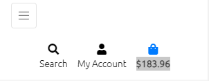
        
        - **Footer** has an style of font-size which is font-size: min(3vw, 15px);, so font size is changing depending on the responsive page but ony up to 15px at max size.
        Overall pages, book page, book detail page, bag page, checkout page, checkout success page and profile page, all behave great down to 317px.
        - **Home** page is responsively shrimping down to 300px without losing UX design
        - **Books page including book detail page** are not lacking of UX design pretty much like what is said about header. Images behave right and are responsive, and the same for book detail page.
        - **Bag, checkout and checkout success** pages are behaving well. Book columns are styled to fit even really small screens. The forms and buttons are also responsive.
        - **Profile** page delivers responsive form fields and order history list adapts to small screens by adding rows so texts do not overlap each other

I am satisfied with the test results, made on computer(1920px), laptop, mobiles(iphone 11 and iphone 7 plus) and tablet(Ipad Air).

# Code Validation
## Python
* Validated python code with [PEP8](http://pep8online.com/) to fulfill requirements and compliant. Made sure not to make any changes on migrations, django.contrib.admin and other important that should not be changed in any way as keys in env. py. Usual errors like ”line too long (91 > 79 characters)” and ” continuation line missing indentation or outdented” were fixed successfully and paython code is now PEP8 compliant and valid. 

## HTML
* **All HTML** pages were tested with the [HTML Validator](https://validator.w3.org/) resulted in errors where the Jinja template language and was used and giving Error: Duplicate ID, but none of these are actual errors within the code itself
    - **Header**, **Footer**, **Toasts**, **Home**, **Books**, **Book Details**, **Bag**, **Checkout**, **Checkout Success** and **Profile** had no errors other than expected errors mentioned above

## CSS
* CSS validation with the [W3C Jigsaw Validator](https://jigsaw.w3.org/css-validator/) returned no errors and the code complies to the W3C standards

## JavaScript
* JavaScript files within the checkout app and profiles app threw a warning about older browser versions. I decided to ignore these as they relates to older browser versions: 'template literal syntax' is only available in ES6 (use 'esversion: 6'). There are no other errors. All Javascript were validated with [JShint](https://jshint.com/) and passed the test

# Deployment
## Installation Prerequisites

To be able to run the project the following technologies will be need to be in intalled in your IDE environment.
- Python3
- Git 
- pip3

You will need to be signed up to the following services:
- [Heroku](https://signup.heroku.com/?c=70130000000NeLCAA0&gclid=Cj0KCQjwpdqDBhCSARIsAEUJ0hMbGWS3dMlZowadFExUalBu2L_UVf27xViAk9dBlCKLsRQI7V2PuScaAmCPEALw_wcB)
- [AWS](https://aws.amazon.com/)
- [Stripe](https://stripe.com/gb)
- [Gmail](https://mail.google.com/)

### Packages Installed
Within **GitPod**, install following packages:
*   [Django](https://www.djangoproject.com/) - *pip3 install django*
*   [Django AllAuth](https://django-allauth.readthedocs.io/en/latest/) - *pip3 install django-allauth*
*   [Pillow](https://pillow.readthedocs.io/en/stable/index.html) - *pip3 install pillow*
*   [Crispy Forms](https://github.com/django-crispy-forms/crispy-bootstrap5) - *pip3 install django-crispy-forms*
*   [Crispy Forms for Bootstrap5](https://github.com/django-crispy-forms/crispy-bootstrap5) - *pip3 install crispy-bootstrap5*
*   [Stripe](https://stripe.com/docs/api) - *pip3 install stripe*
*   [Django Countries](https://pypi.org/project/django-countries/) - *pip3 install django-countries*
*   [DJ Database URL](https://pypi.org/project/dj-database-url/) - *pip3 install dj_database_url*
*   [Psycopg2](https://pypi.org/project/psycopg2-binary/) - *pip3 install psycopg2-binary*
*   [Gunicorn](https://pypi.org/project/gunicorn/) - *pip3 install gunicorn*
*   [Boto3](https://pypi.org/project/boto3/) - *pip3 install boto3*
*   [Django Storages](https://pypi.org/project/django-storages/) - *pip3 install django-storages*
